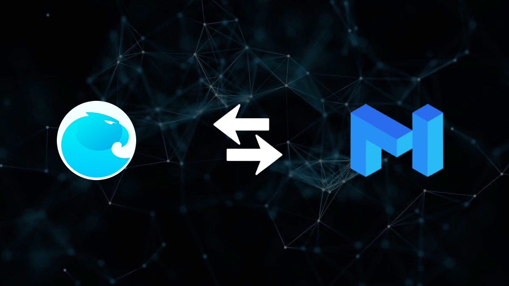

# Aragon On Matic

Export and Import Your Current Aragon Organization To Matic For Cheaper Voting

HackMD Link: https://hackmd.io/@blU6cns0RpmVLGig0cj9nw/Hyv6P2jxv

[Website](https://www.aragomatic.com)

Codenamed: AragoMatic

Video Demo: 

Aragon Company Factory on the Matic Mainnet:

https://explorer.matic.network/address/0xbE5bC19764b155937192Da0e1a27aA68526a5c3e/

## Summary
Today, Ethereum gas prices make it very difficult and expensive to interact with Aragon DAOs. It can cost as much as $4 to vote on a proposal and $10 to create a proposal in Aragon DAOs. AragonOnMatic migrates an existing organization to the Matic sidechain and allows users to migrate their Aragon state to the Mainnet at much cheaper costs.

## Developer Quick Start

As Matic puts it: "If you're an Ethereum Developer, you're already a Matic developer. All the tools you're familiar with are supported on Matic out of the box: Truffle, Remix, Web3js. Switch over to Matic's RPC and get started!"

Matic Docs: [https://docs.matic.network/docs/develop/getting-started](https://docs.matic.network/docs/develop/getting-started)

## How To Use

This solution helps you move your current Aragon org from Mainnet to Matic, and interface with the same Aragaon DAO UI your org already knows and loves, but with cheaper transaction costs. $2 to vote is a bit high right? That's what it is these days, and it's just not realistic.

In this current version, you can deploy a DAO using the Aragon company template or interface with the existing DAO factory contract on Matic ([Mainnet address](https://explorer.matic.network/address/0xbE5bC19764b155937192Da0e1a27aA68526a5c3e/)) to produce a DAO and token. Additionally, you can add those token to the Matic Wallet once they are deployed and move the governance coins between chains.

## TODO

-State Mirroring

-Automatic Monetary Transfer Option on Mainnet upon vote on Sidechain

-Better tests

-Matic-Specific UI for on-off ramping
